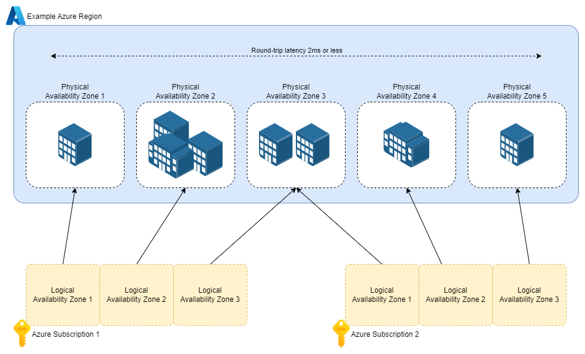

# Mapping Logical Availability Zones to Physical Zones in Azure

This guide provides step-by-step instructions on how to derive the mapping between Logical Availability Zones and Physical Availability Zones in Microsoft Azure. Understanding this mapping is crucial for deploying resources across subscriptions with redundancy and high availability.

## Table of Contents

- [Introduction to Availability Zones](#introduction-to-availability-zones)
- [Physical vs. Logical Availability Zones](#physical-vs-logical-availability-zones)
- [Prerequisites](#prerequisites)
- [Register the AvailabilityZonePeering Feature](#register-the-availabilityzonepeering-feature)
- [Prepare the PowerShell Script](#prepare-the-powershell-script)
- [Execute the Script](#execute-the-script)
- [Interpret the Output](#interpret-the-output)
- [Additional Resources](#additional-resources)

---

## Introduction to Availability Zones

### What Are Availability Zones?

Availability Zones are distinct physical locations within a single Azure region. Each zone is designed to be independent of the others, with its own power, cooling, and networking. An Availability Zone may consist of a single datacenter or multiple datacenters working together. To ensure high availability, these zones are connected via a high-performance network, which Microsoft guarantees has a round-trip latency of less than **2 milliseconds**.

Not all Azure regions support Availability Zones. For the most up-to-date list of regions with this support, refer to the official Azure documentation.

### Service Deployment and Availability Zones

When deploying Azure services in a region with Availability Zone support, there are two primary models to consider:

1. **Zonal Services**: These services are pinned to a specific Availability Zone. This is typical for **Infrastructure-as-a-Service (IaaS)** offerings like virtual machines and managed disks. You, as the user, decide which zone to deploy these services into.

2. **Zone-Redundant Services**: These services are automatically distributed across multiple Availability Zones for redundancy. This approach is common for **Platform-as-a-Service (PaaS)** offerings like Azure SQL Database and Azure Storage accounts.

Some services might not support Availability Zones at all, so it’s essential to check the specific capabilities of each service before deployment.

---

## Physical vs. Logical Availability Zones

Azure regions with Availability Zones always have at least **three physical zones**. In some cases, regions may contain more than three physical zones. However, the way these zones are exposed to an Azure Subscription introduces an important distinction between **physical zones** and **logical zones**:

- **Logical Zones**: Each subscription has access to three logical zones, named **Zone 1**, **Zone 2**, and **Zone 3**. These logical zones are a simplified abstraction to enable consistent configuration and user experience.

- **Physical Zones**: Logical zones are mapped to physical zones when a subscription is created. For example, logical Zone 1 might map to physical Zone 3 in one subscription but physical Zone 1 in another. This mapping is determined automatically by Azure and cannot be customized or altered.




<small>Image from https://www.nathannellans.com/post/azure-availability-zones</small>


### Key Considerations

1. **Fixed Mappings**: The mapping of logical zones to physical zones is permanent for a given subscription and cannot be changed later. This means the physical zone corresponding to logical Zone 1 in Subscription A may differ from that in Subscription B.

2. **Multi-Subscription Deployments**: When deploying across multiple subscriptions, it’s critical to understand the physical zone mappings of each subscription to ensure proper redundancy. This is where tools like the `checkZonePeers` API come into play, allowing you to identify zone mappings across subscriptions.

3. **High Availability**: By leveraging either zonal or zone-redundant services, you can architect solutions to withstand data center-level failures, ensuring business continuity and minimal downtime.

---

## Prerequisites

- **Azure PowerShell Module**: Ensure you have the Azure PowerShell module installed. If not, install it using:

  ```powershell
  Install-Module -Name Az -AllowClobber -Scope CurrentUser
  ```

- **Azure Account**: You must have an Azure account with the necessary permissions to register features and access subscription details.

- **Peer Subscription ID**: The subscription ID of the peer with which you want to compare Availability Zones.

---

## Register the AvailabilityZonePeering Feature

Before determining the mapping, register the `AvailabilityZonePeering` feature in your subscription:

```bash
# Register the AvailabilityZonePeering feature
az feature register --namespace Microsoft.Resources --name AvailabilityZonePeering --subscription YOUR_PEER_SUBSCRIPTION_ID

# Register the Microsoft.Resources provider
az provider register --namespace Microsoft.Resources --subscription YOUR_PEER_SUBSCRIPTION_ID
```

**Note**: It may take some time for the feature to register. Check the status using:

```bash
az feature show --namespace Microsoft.Resources --name AvailabilityZonePeering  --subscription YOUR_PEER_SUBSCRIPTION_ID
```

Wait until the `registrationState` is `Registered` before proceeding.

---

## Prepare the PowerShell Script

Use the following PowerShell script to determine the mapping:

```powershell
# Set your current subscription ID
$subscriptionId = (Get-AzContext).Subscription.ID

# Replace with your peer's subscription ID
$PeerSubscriptionId = "YOUR_PEER_SUBSCRIPTION_ID"

# Set the Azure region you're interested in
$location = "centralus"

# Prepare the subscription IDs array
$subscriptionIds = @("/subscriptions/$PeerSubscriptionId")

# Create the payload for the API call
$payload = @{
    "location" = $location
    "subscriptionIds" = $subscriptionIds
}

# Convert the payload to JSON format
$payloadJson = $payload | ConvertTo-Json

# Invoke the REST API to check zone peers
$response = Invoke-AzRestMethod -Method POST -Path "/subscriptions/$subscriptionId/providers/Microsoft.Resources/checkZonePeers?api-version=2022-12-01" -Payload $payloadJson

# Display the response in JSON format
$response.Content | ConvertFrom-Json | ConvertTo-Json -Depth 100
```

**Important**: Replace `"YOUR_PEER_SUBSCRIPTION_ID"` with the actual subscription ID of your peer.

---

## Execute the Script

1. **Login to Azure**: Open PowerShell and log in to your Azure account if not already logged in:

   ```powershell
   Connect-AzAccount
   ```

2. **Run the Script**: Copy the prepared script into your PowerShell session and execute it.

3. **Example Output**:

   ```json
   {
     "subscriptionId": "YOUR_SUBSCRIPTION_ID",
     "location": "centralus",
     "availabilityZonePeers": [
       {
         "availabilityZone": "1",
         "peers": [
           {
             "subscriptionId": "PEER_SUBSCRIPTION_ID",
             "availabilityZone": "2"
           }
         ]
       },
       {
         "availabilityZone": "2",
         "peers": [
           {
             "subscriptionId": "PEER_SUBSCRIPTION_ID",
             "availabilityZone": "3"
           }
         ]
       },
       {
         "availabilityZone": "3",
         "peers": [
           {
             "subscriptionId": "PEER_SUBSCRIPTION_ID",
             "availabilityZone": "1"
           }
         ]
       }
     ]
   }
   ```

---

## Interpret the Output

The output JSON provides the mapping between your logical Availability Zones and the physical Availability Zones across subscriptions:

- **`subscriptionId`**: Your subscription ID.
- **`location`**: The Azure region queried.
- **`availabilityZonePeers`**: An array containing the mapping details.

### Understanding the Mapping

Each object within `availabilityZonePeers` contains:

- **`availabilityZone`**: Your logical Availability Zone.
- **`peers`**: An array of peer subscriptions and their corresponding Availability Zones.

**Example Interpretation**:

- Your **Zone 1** corresponds to **Zone 2** in the peer subscription.
- Your **Zone 2** corresponds to **Zone 3** in the peer subscription.
- Your **Zone 3** corresponds to **Zone 1** in the peer subscription.

---

## Additional Resources

- **Azure REST API Documentation**: [Check Zone Peers](https://learn.microsoft.com/en-us/rest/api/resources/subscriptions/check-zone-peers?view=rest-resources-2022-12-01&tabs=HTTP)
- **Azure Availability Zones**: [Overview](https://learn.microsoft.com/en-us/azure/availability-zones/az-overview)
- **Azure PowerShell Module**: [Installation Guide](https://learn.microsoft.com/en-us/powershell/azure/install-az-ps)

---

**Disclaimer**: The script and instructions provided are for educational purposes. Always test scripts in a controlled environment before using them in production.
